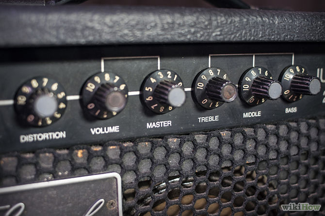

```{r include=FALSE}
# You can redefine these in a master document.
if( !exists(".document.settings.")) {
  require(mosaic)
  require(mosaicData)
  
}
```

A model is a representation of something to serve a purpose. Some models are made of clay or balsa wood or legos. Mathematical models are made out of the stuff of mathematics: equations, functions, and so on. Statistical models are a kind of mathematical model where data plays a central role.  The modeler specifies the general structure of the model, for instance $m x+ b$. The data fills in the details to make things specific, e.g. that $m=2.3$ and $b=14.6$.

Another defining characteristic of statistical models is the use of the data to find out how "good" the fitted model is. "Good" can mean different things to different people.  In statistical thinking, "How good?" might mean "How reproducible with new data?" or "What is the error in a prediction likely to be?"  Often it means, "Do the data justify an elaboration on a simpler model?"

This chapter lays some of the foundations for learning about statistical modeling.  If you have previous experience with the R language, you may be already be familiar with how R works.  If not, you may want to refer to one of the many good introductions to computing with R.

### Start with a real question

An important foundation for modeling and for teaching modeling is process.

Often, statistics instructors start with data.  Data are crucial to statistical modeling, but they are not the place to start.

Instead, start with the *purpose* for using the data.  For a classroom teacher, it's easy to fall into a triviality, that the purpose is to teach a technique.  That might be true in a classroom, but it is not the case for actual applications of statistics and modeling. Sometimes, there is a "research question" or "research hypothesis" that the modeling is meant to test.  Sometimes the purpose of the model is to predict or classify.  The purpose reflects what you want to do with the model or the sort of conclusion you would like to be able to reach. 

To teach your students that they should think about the purpose of their models, you should demonstrate to them that this is an important part of the modeling process. 

In these notes, a few examples will be used.  Each is a simple setting, with just a few variables.  When you work with an example, make sure to specify the purpose of the model you are building.  It's good practice to start the modeling process with a question: What is the model for?  For instance, 

* trebuchet launches
    * How far will a new object be thrown?
* swimming
    * What's a typical difference between men's and women's records and how is this difference changing over time?  
* wages
    * Do variables other than sex account for the differences between men's and women's wages?
* longevity and smoking
    * Does smoking affect lifespan?
 
### Mathematical frameworks for modeling

The most commonly used mathematical framework in statistical modeling is the idea of a *function*.  As you may remember, a mathematical function is a relationship between one or more inputs and an output.  For each possible input, there is one, and only one, output.

Sometimes you can represent a function with a graph.  Other times, a function might be given by a formula.  There are more ways than this to represent a function (e.g. smoothers, splines, ...), but graphs and formulas are the most important ones to start with.

What kind of function?  What kind of formula?  Your students studied all sorts of functions in high school: trigonometric functions, polynomials, exponentials and logarithms, etc.  For statistical modeling, the most important and most widely used kind of function is the linear combination of inputs.  Your students will have seen and example of this as the formula $mx + b$ --- the formula for a straight line.  The value of $x$ is the input, $m$ and $b$ are numerical *coefficients* (also called *parameters*).  The function is $f(x) = mx + b$ --- input $x$ gives output $mx + b$.

Your students will go further.  They will call the coefficient $m$ the "slope," and the coefficient $b$ the "intercept."  The intercept is the value of the function when the input is zero.

When there is more than one input, say $x$ and $z$, the linear combination function has the formula $f(x,z) = a + bx + cz$.  Fewer students will be familiar with this form.  You will have to introduce it to them:

* Fix the numerical values of the coefficients $a$, $b$, and $c$. Have your students calculate the output for specific values of the inputs $x$ and $y$.
* Show them that $a$ is the intercept, the value of the function when the input is zero.
* Ask them, "What is the slope?"  Steer them toward understanding that there is more than one slope.  One of the slopes tells how the output changes with $x$, the other tells how the output changes with $z$. You might want to talk about slopes as "rates of change with respect to ... ."  This allows you to emphasize that slopes are always with respect to some variable and that variable must always be specified to speak meaningfully of slopes.
* Perhaps better than "slope" is to speak of "sensitivity".  Imagine the function as a machine with control knobs for the inputs.  As you change the settings of the knobs, the output of the machine changes.

CAPTION: A guitar amplifier.  There are several inputs, each of which can influence the output.


<<! http://pad1.whstatic.com/images/thumb/b/b3/Choose-a-Beginner-Electric-Guitar-and-Amp-on-a-Budget-Step-7.jpg/670px-Choose-a-Beginner-Electric-Guitar-and-Amp-on-a-Budget-Step-7.jpg -->


The presentation of a function as a graph is also important.  Your students will have spent many hours with graphs like this one:

```{r echo=FALSE, fig.keep='last'}
f <- makeFun( 3*x - 2 ~ x)
plotFun( f(x)~x, x.lim=range(0,5), 
         xlab="Input (x)", ylab="Output", lwd=2)
```

CAPTION: Graph of a linear combination function.

Your students may not be as familiar with the appearance of graphs of functions of two inputs. For instance, consider this contour graph of a function of two inputs: age and wage.

```{r echo=FALSE}
g <- makeFun(0.2*x - 3.5*z + x*z ~ x + z)
plotFun( g(x,y)~ x&y, x.lim=c(0,20), y.lim=c(7,12),
         xlab="Input: age", ylab="Input: wage")
```

The two axes indicate the inputs.  The output value is indicated by the numbers printed along the contours.  In between the contours, the reader infers the numerical value of the output by interpolating between nearby contours.

Another way to graph this function has one input along the horizontal axis, with the vertical graph specifying the output.  The value of the other input is represented by the different line types or colors.

```{r echo=FALSE, fig.keep="last"}
plotFun( g(x=age, z=8) ~ age, age.lim=c(0,20), lwd=2, ylab="Output")
plotFun( g(x=age, z=10) ~ age, add=TRUE, lty=2, lwd=3)
```

What about the more complicated functions that show up in mathematics textbooks: polynomials, sines and cosines, exponentials, logs, powers, ... ?  You won't need them.  OK, it's possible that there might be some setting where these functions would be appropriate, but that's rare.

Here are the modeling functions your students need to know:

1. Linear combinations.
#. Sigmoidal functions, particular the logistic function. (See Chapter XXXXX)

That's a short list!  If you were to add a new form, make it CART. 

Sometimes you will want to create new inputs and outputs that are transformations.  Logarithm and rank transformations lead the list.  But you'll use those transformations in the linear and sigmoidal forms of functions.

The mathematical curriculum traditionally starts with straight line functions, $f(x) = m x + b$, and moves up to quadratics, $g(x) = a + bx + c x^2$, and then up to cubics, $h(x) = a + bx + c x^2 + d x^3$, and so on.  Technically, these are linear combinations of the powers of $x$, but this is not often a productive way to go in statistical modeling. Judging from the literature in many fields, it's much more important in statistical modeling to think about linear combinations of different variables rather than powers of a single variable. 

Your students will be able to learn about statistical models, and build many models relevant to their topics of interest, using *just linear combinations*.


### Organization of data

Cases, variables

Reading in data (use `read.csv()` and `data()`)

Looking at the form and the variable names. `head()`, `str()`

Best to store data sets on the web and give students the URL.  See Start Teaching with R?????

### The statistical command template

mean(), sd(), xyplot(), `favstats()`, etc.

### Data manipulation

mutate(), filter()
